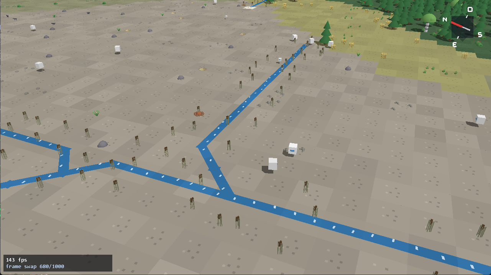

Everything is written in Polaron — the worldgen, the 3D renderer, the simulation — with no
engine underneath it. The only thing borrowed is OpenGL itself, through
[Polaron-OpenGL](https://github.com/jvpts11/Polaron-OpenGL), which is also Polaron. That is half
the point: the game is the language's stress test, and every hole it walks into gets fixed in
the compiler rather than worked around in the game.

*Rivers cut the plain, herds graze it, and the forest holds the ridge.*

## The ground

A world of 2560×1440 cells is searched for rather than rolled: it is generated, measured against
criteria such as one continent instead of fourteen islands, and rejected if it fails. Tectonic
plates give the relief, climate follows the relief, rivers follow the climate, biomes follow
both, and forests and ore bodies follow the biomes.

## The fauna

About fifteen thousand animals live on it, seventeen species described by real numbers: how
fast, how shy, how long they live, how many run together, what ground they can live on. Nothing
above that is scripted:

- a herd thinks and a beast follows, which is a few thousand decisions driving fifteen thousand
  moves rather than fifteen thousand decisions;
- flight is one comparison against how shy the animal is, and running costs stamina;
- the hunt has no chase routine at all: prey flees in bursts, a pack walks and does not tire,
  and the animal that falls behind is the animal that gets caught;
- a species can end, permanently, and the world says which of five things did it.
